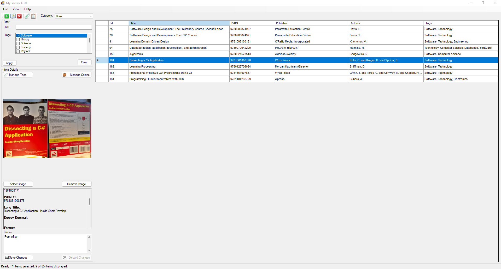

# MyLibrary

## Description and Requirements
A Windows desktop application for keeping track of books and other "library" items. I have a huge collection of them and wanted to start keeping track of them, and couldn't find anything that suits my needs exactly. Oh, and I wanted to have a go at coding my own ;)

### Requirements
- .NET Framework 4.7.2
- Microsoft Visual Studio (for development)



## Contents
```
root
|
+--docs
|     |
|     +--design // Requirements and design of the application. Detailed design is a living document describing the current design and architecture of the application.
|     |
|     +--user // documentation intended for users
|
+--src // source code - Visual Studio solution
|    |
|    +--MyLibrary // application
|    |
|    +--MyLibrary_Tests // unit tests
|    |
|    +--DBTool // tool for "seeding" data
|
+--scripts
|        |
|        +--init.sql // set up DB
|
+--README.md
+--.gitignore
```
All notable changes to this project are documented in `CHANGELOG.md`.

## Installation and Setup
1. Clone the repo: `git clone https://github.com/Alc2110/MyLibrary.git`.
2. Compile.
3. Set the `dbPath` in `app.config` to the path of the database (`database.db`).

## Architecture
WinForms application connected to a bundled Sqlite database. For more information, refer to `docs\design\detailed_design.md`.

## Usage
A user manual is provided in `docs\user`.

## Known Issues and Solutions
Described in user manual. 

## Attributions
- Icons by Yusuke Kamiyamane: https://p.yusukekamiyamane.com/
- Newtonsoft.Json 13.0.1 by James Newton-King
- Dapper 2.0.123 by Sam Saffron, Marc Gravell and Nick Craver
- EPPlus 5.8.8 by EPPlus Software AB
- CircularProgressBar 2.8.0.16 by Soroush Falahati
- WinFormAnimation 1.6.0.4 by Soroush Falahati
- EntityFramework 6.4.4 by Microsoft
- Microsoft.Data.Sqlite.Core by Microsoft

## Contributing
Pull requests are welcome. For major changes, please open an issue first to discuss what you would like to change. Please make sure to update tests as appropriate.