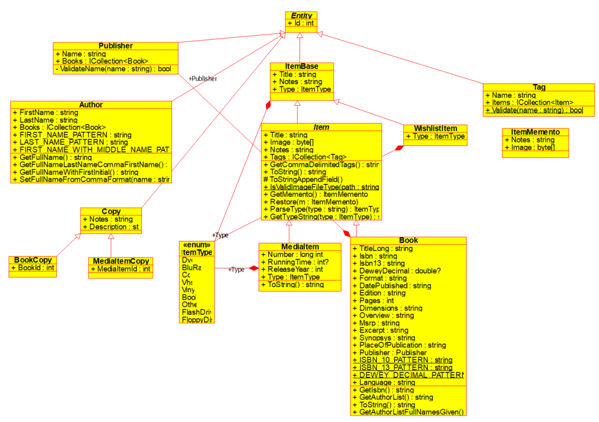

# Detailed Design
This document describes some of the detail of the data, architecture and user interface design of the application. It is a living document and updated as the design changes due to obstacles being overcome and as development progresses.

## Data Design

### Database
- Persistence is provided with a relational database, in particular, Sqlite.
- The Entity Relationship Diagram showing the tables and relationships follows:


- The data dictionary for the database tables follows:
#### Books
|**Field**|**Data Type**|**Nullable**|**Comments/Description**|
|---------|-------------|------------|---------------|
|id       |INTEGER      |No          |Primary key, autoincremented.|
|title    |TEXT         |No          |               |
|titleLong|TEXT         |No          |               |
|isbn     |TEXT         |Yes         |               |
|isbn13   |TEXT         |Yes         |               |
|deweyDecimal|REAL      |Yes         |               |
|publisherId|INTEGER    |No          |Foreign key, references (Publishers)id.|
|format   |TEXT         |Yes         |               |
|language |TEXT         |No          |               |
|datePublished|TEXT     |Yes         |               |
|placeOfPublication |TEXT|Yes        |               |
|edition  |TEXT         |Yes         |               |
|pages    |INTEGER      |No          |               |
|dimensions|TEXT        |Yes         |               |
|overview |TEXT         |Yes         |               |
|image    |BLOB         |Yes         |               |
|msrp     |TEXT         |Yes         |               |
|excerpt  |TEXT         |Yes         |               |
|synopsys |TEXT         |Yes         |               |
|notes    |TEXT         |Yes         |Free text field to write anything you like.|
&nbsp;

#### Authors
|**Field**|**Data Type**|**Nullable**|**Comments/Description**|
|---------|-------------|------------|---------------|
|id       |INTEGER      |No          |Primary key, autoincremented|
|firstName|TEXT         |No          |Unique constraint on (firstName, lastName).|
|lastName |TEXT         |No          |Unique constraint on (firstName, lastName).|
&nbsp;

#### Publishers
|**Field**|**Data Type**|**Nullable**|**Comments/Description**|
|---------|-------------|------------|---------------|
|id       |INTEGER      |No          |Primary key, autoincremented|
|name     |TEXT         |No          |Unique constraint|
&nbsp;

#### Media
|**Field**|**Data Type**|**Nullable**|**Comments/Description**|
|---------|-------------|------------|---------------|
|id       |INTEGER      |No          |Primary key, autoincremented|
|title    |TEXT         |No          |               |
|type     |INTEGER      |No          |               |
|image    |BLOB         |Yes         |               |
|runningTime|INTEGER    |No          |               |
|releaseYear|INTEGER    |No          |               |
|notes    |TEXT         |Yes         |Free text field to write anything you like.|
&nbsp;

#### Tags
|**Field**|**Data Type**|**Nullable**|**Comments/Description**|
|---------|-------------|------------|---------------|
|id       |INTEGER      |No          |Primary key, autoincremented|
|name     |TEXT         |No          |               |
&nbsp;

#### Book_Tag
|**Field**|**Data Type**|**Nullable**|**Comments/Description**|
|---------|-------------|------------|---------------|
|id       |INTEGER      |No          |Primary key, autoincremented|
|bookId   |INTEGER      |No          |Foreign key, references (Books)id. Unique constraint on (bookId, authorId).|
|TagId    |INTEGER      |No          |Foreign key, references (Tags)id. Unique constraint on (bookId, authorId).|
&nbsp;

#### Book_Author
|**Field**|**Data Type**|**Nullable**|**Comments/Description**|
|---------|-------------|------------|---------------|
|id       |INTEGER      |No          |Primary key, autoincremented|
|bookId   |INTEGER      |No          |Foreign key, references (Books)id. Unique constraint on (bookId, authorId).|
|authorId |INTEGER      |No          |Foreign key, references (Author)id. Unique constraint on (bookId, authorId).|
&nbsp;

#### Media_Tag
|**Field**|**Data Type**|**Nullable**|**Comments/Description**|
|---------|-------------|------------|---------------|
|id       |INTEGER      |No          |Primary key, autoincremented|
|mediaId  |INTEGER      |No          |Foreign key, references (Media)id. Unique constraint on (mediaId, tagId).               |
|tagId    |INTEGER      |No          |Foreign key, references (Tags)id. Unique constraint on (mediaId, tagId).               |
&nbsp;

### Entity model
- The entities used in the client application are based on the structure of the database.
- A UML diagram of the entity model follows:



## Architecture Design
- The software comprises a local Sqlite database and a client application implemented in WinForms targeting .NET Framework 4.7.2.

&nbsp;

## Interface Design
### Main User Interface
#### Main Window


### Adding a new item


### API Interface
OpenLibrary API is used to find book data online. There is a dialog allowing the user to search for book data by ISBN, and pre-fill the add new book dialog with the returned data.

When a search is made using an ISBN, a query is made to the following endpoint:
```
https://openlibrary.org/isbn/{isbn}.json
```
The data used to pre-fill an add new book dialog are the following:
- The first entry in the resulting `publishers` array
- The first entry in the resulting `publish_places` array
- The `title`
- The `number_of_pages`
- The `isbn_13`
- The `isbn_10`
- The `publish_date`
- In addition, the authors are retrieved using all objects from the `authors` array, using the endpoint `https://openlibrary.org/authors/{author_key}.json`. The resulting `name` field is used.