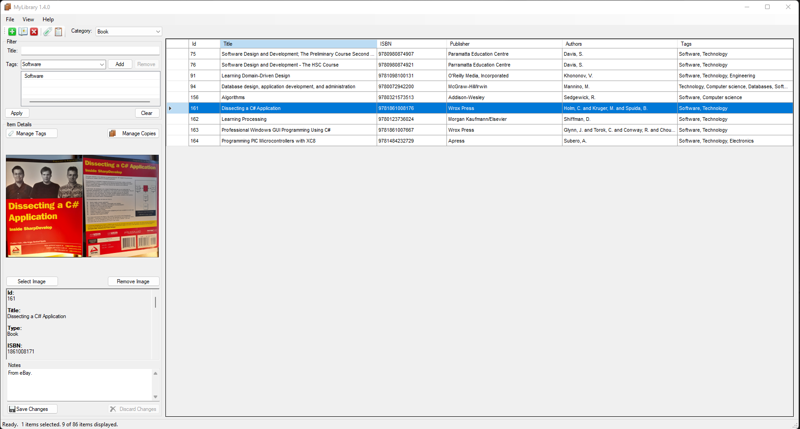
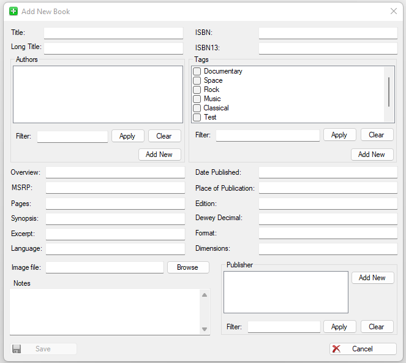
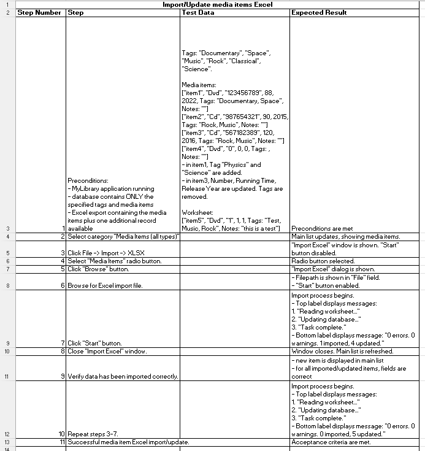

# Detailed Design
This document describes some of the detail of the data, architecture and user interface design of the application. It is a living document and updated as the design changes due to obstacles being overcome and as development progresses.

## Data Design

### Database
- Persistence is provided with a relational database, in particular, Sqlite.
- The Entity Relationship Diagram showing the tables and relationships follows:


- The data dictionary for the database tables follows:
#### Books
|**Field**|**Data Type**|**Nullable**|**Comments/Description**|
|---------|-------------|------------|---------------|
|id       |INTEGER      |No          |Primary key, autoincremented.|
|title    |TEXT         |No          |Unique.               |
|titleLong|TEXT         |No          |               |
|isbn     |TEXT         |Yes         |               |
|isbn13   |TEXT         |Yes         |               |
|deweyDecimal|REAL      |Yes         |               |
|publisherId|INTEGER    |No          |Foreign key, references (Publishers)id.|
|format   |TEXT         |Yes         |               |
|language |TEXT         |No          |               |
|datePublished|TEXT     |Yes         |               |
|placeOfPublication |TEXT|Yes        |               |
|edition  |TEXT         |Yes         |               |
|pages    |INTEGER      |No          |               |
|dimensions|TEXT        |Yes         |               |
|overview |TEXT         |Yes         |               |
|imageId    |INTEGER         |Yes         |Foreign key, references (Images)id.               |
|msrp     |TEXT         |Yes         |               |
|excerpt  |TEXT         |Yes         |               |
|synopsys |TEXT         |Yes         |               |
|notes    |TEXT         |Yes         |Free text field to write anything you like.|
&nbsp;

#### Authors
|**Field**|**Data Type**|**Nullable**|**Comments/Description**|
|---------|-------------|------------|---------------|
|id       |INTEGER      |No          |Primary key, autoincremented|
|firstName|TEXT         |No          |Unique constraint on (firstName, lastName).|
|lastName |TEXT         |No          |Unique constraint on (firstName, lastName).|
&nbsp;

#### Publishers
|**Field**|**Data Type**|**Nullable**|**Comments/Description**|
|---------|-------------|------------|---------------|
|id       |INTEGER      |No          |Primary key, autoincremented|
|name     |TEXT         |No          |Unique constraint|
&nbsp;

#### Media
|**Field**|**Data Type**|**Nullable**|**Comments/Description**|
|---------|-------------|------------|---------------|
|id       |INTEGER      |No          |Primary key, autoincremented|
|title    |TEXT         |No          |Unique.               |
|type     |INTEGER      |No          |Cd=1; Dvd=2; BluRay=3; Vhs=4; Vinyl=5; Other=6; Flash Drive=7; Floppy Disk=8               |
|number   |INTEGER      |No          |               |
|imageId    |INTEGER         |Yes         |Foreign key, references (Images)id.               |
|runningTime|INTEGER    |Yes          |               |
|releaseYear|INTEGER    |No          |               |
|notes    |TEXT         |Yes         |Free text field to write anything you like.|
&nbsp;

#### Images
|**Field**|**Data Type**|**Nullable**|**Comments/Description**|
|---------|-------------|------------|---------------|
|id       |INTEGER      |No          |Primary key, autoincremented|
|image    |BLOB         |Yes            |Image          |
&nbsp;

#### Tags
|**Field**|**Data Type**|**Nullable**|**Comments/Description**|
|---------|-------------|------------|---------------|
|id       |INTEGER      |No          |Primary key, autoincremented|
|name     |TEXT         |No          |               |
&nbsp;

#### Book_Tag
|**Field**|**Data Type**|**Nullable**|**Comments/Description**|
|---------|-------------|------------|---------------|
|id       |INTEGER      |No          |Primary key, autoincremented|
|bookId   |INTEGER      |No          |Foreign key, references (Books)id. Unique constraint on (bookId, authorId).|
|TagId    |INTEGER      |No          |Foreign key, references (Tags)id. Unique constraint on (bookId, authorId).|
&nbsp;

#### Book_Author
|**Field**|**Data Type**|**Nullable**|**Comments/Description**|
|---------|-------------|------------|---------------|
|id       |INTEGER      |No          |Primary key, autoincremented|
|bookId   |INTEGER      |No          |Foreign key, references (Books)id. Unique constraint on (bookId, authorId).|
|authorId |INTEGER      |No          |Foreign key, references (Author)id. Unique constraint on (bookId, authorId).|
&nbsp;

#### Media_Tag
|**Field**|**Data Type**|**Nullable**|**Comments/Description**|
|---------|-------------|------------|---------------|
|id       |INTEGER      |No          |Primary key, autoincremented|
|mediaId  |INTEGER      |No          |Foreign key, references (Media)id. Unique constraint on (mediaId, tagId).               |
|tagId    |INTEGER      |No          |Foreign key, references (Tags)id. Unique constraint on (mediaId, tagId).               |
&nbsp;

#### Wishlist
|**Field**|**Data Type**|**Nullable**|**Comments/Description**|
|---------|-------------|------------|---------------|
|id       |INTEGER      |No          |Primary key, autoincremented|
|title    |TEXT         |No          |Unique constraint               |
|type     |INTEGER      |No          |Book=0; Cd=1; Dvd=2; BluRay=3; Vhs=4; Vinyl=5; Other=6; Flash Drive=7; Floppy               |
|notes    |TEXT         |Yes         |Free text field to write anything you like.               |
&nbsp;

#### BookCopies
|**Field**|**Data Type**|**Nullable**|**Comments/Description**|
|---------|-------------|------------|---------------|
|id       |INTEGER      |No          |Primary key, autoincremented|
|description |TEXT      |No          |               |
|bookId   |INTEGER      |No          |Foreign key, references (Books)id.
&nbsp;

#### MediaItemCopies
|**Field**|**Data Type**|**Nullable**|**Comments/Description**|
|---------|-------------|------------|---------------|
|id       |INTEGER      |No          |Primary key, autoincremented|
|description |TEXT      |No          |               |
|mediaItemId   |INTEGER      |No          |Foreign key, references (Media)id.
&nbsp;

### Entity model
- The entities used in the client application are based on the structure of the database.
- A UML diagram of the entity model follows:


## Architecture Design
- The software comprises a local Sqlite database and a client application implemented in WinForms targeting .NET Framework 4.7.2.
- The application is based on a **Model-View-Presenter** architecture. The data access layer implements the **repository** and **unit of work** patterns.


&nbsp;

## Interface Design
### Main User Interface
#### Main Window


### Adding a new item


### API Interface
OpenLibrary API is used to find book data online. There is a dialog allowing the user to search for book data by ISBN, and pre-fill the add new book dialog with the returned data.

When a search is made using an ISBN, a query is made to the following endpoint:
```
https://openlibrary.org/isbn/{isbn}.json
```
The data used to pre-fill an add new book dialog are the following:
- The first entry in the resulting `publishers` array
- The first entry in the resulting `publish_places` array
- The `title`
- The `number_of_pages`
- The `isbn_13`
- The `isbn_10`
- The `publish_date`
- In addition, the authors are retrieved using all objects from the `authors` array, using the endpoint `https://openlibrary.org/authors/{author_key}.json`. The resulting `name` field is used.

### Exports
Exporting and importing data in XLSX and CSV format is supported.

For books, author entries are in the format: `Firstname Lastname; Firstname Lastname`.

#### Excel
Each export has a metadata section indicating the date and time it was created and the application version that created it. It has a row for each record, comprised of the Id and other fields. Images are not included.


Selected fields are modifiable for the different export types. They are the following:
- Books: Overview, MSRP, Synopsis, Excerpt, Dewey Decimal, Dimensions, Notes, Tags (must be in comma-and-space-separated format. Any unidentified tags will be interpreted as new tags). Images are not updateable in this fashion.
- Media Items: Notes, Tags (must be in comma-and-space-separated format. Any unidentified tags will be interpreted as new tags). Images are not updateable in this fashion.
When an export file is used as an import, the modified data will be updated in the database.

- Metadata and header colour: background ARGB 255,0,0,170 / text ARGB 255,255,255,255
- Even row colour: background ARGB 255,239,239,255
- Odd row colour: background ARGB 255,207,207,255

#### CSV
The following types can be imported as bulk imports:
- Tags
- Authors
- Publishers

These types are uniquely identifiable by their name or title fields, so if there are any already in the database, they will be skipped.

### Excel imports
- Supported for books and media items.
- Selected fields are editable. Columns which are not editable will be locked.
- Must be in format of Excel exports.

The import process is based on a series of steps:
1. Excel worksheet is validated. It must be in the same format as the exports.
2. Each data row is read. If the id column is empty, it is interpreted as a new row. If it is not empty, it is interpreted as an item to be updated, in which case the data must be in a valid format for all fields, otherwise the entire row is skipped.
3. Each row is then imported or updated in the database.

#### Book imports
Author entries must be in the format: `Firstname Lastname; Firstname Lastname`.

#### User interface


#### Test cases
